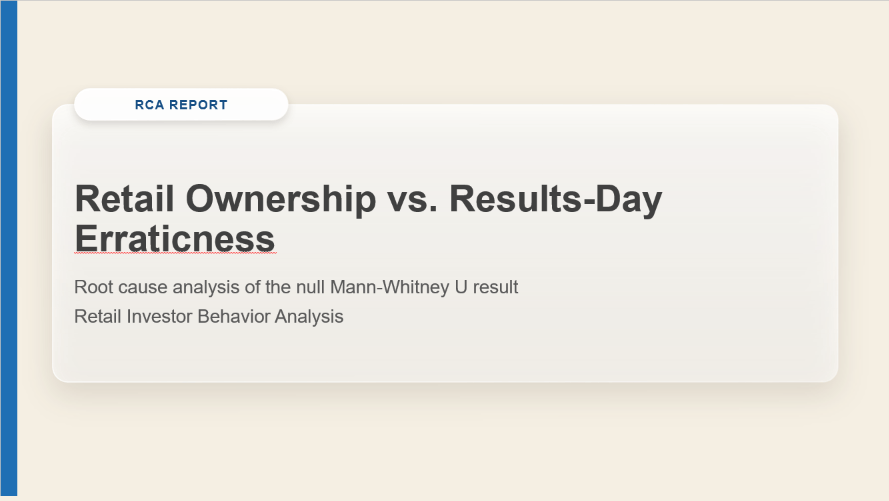

# Retail-Heavy Stocks vs. Results-Season Erraticness

A statistical case study on Indian equities: **do NSE stocks with a high share of public/retail ownership behave more erratically around their quarterly results than stocks owned mostly by institutions?**

**Short answer: no.** Across 20 stocks and 8 quarters, the High-retail and Low-retail buckets show no significant difference on any of the three metrics, at either event-window width. Where there is a trend, it runs the other way: Low-retail stocks were slightly *more* erratic. The more interesting result came from the follow-up tests. **Domestic institutional (DII) ownership, not retail ownership, has a significant (negative) relationship with volatility around results.**

---

## Research question

> Do stocks with a high public-retail shareholding % show more erratic price/volume behavior around their quarterly results date than stocks with a low retail shareholding %?

- **H0:** The distributions of results-window erraticness metrics are the same for High-retail and Low-retail stocks.
- **H1:** They differ. The working expectation was that High-retail stocks would be more erratic.

---

## Stock universe

20 NSE-listed stocks, 10 per sector. Each was tagged up front with an `expected_retail_tilt` based on prior knowledge. That tag is **not** used for bucketing; the High/Low buckets come from the actual shareholding data (see [Methodology](#methodology)).

| Sector | Ticker | Company | Expected retail tilt |
|---|---|---|---|
| Finance | HDFCBANK | HDFC Bank | Low |
| Finance | ICICIBANK | ICICI Bank | Low |
| Finance | KOTAKBANK | Kotak Mahindra Bank | Low |
| Finance | BAJFINANCE | Bajaj Finance | Low |
| Finance | BAJAJFINSV | Bajaj Finserv | Low-Medium |
| Finance | PNB | Punjab National Bank | Medium-High |
| Finance | BANKBARODA | Bank of Baroda | Medium-High |
| Finance | IDFCFIRSTB | IDFC First Bank | Medium |
| Finance | YESBANK | Yes Bank | High |
| Finance | IIFL | IIFL Finance | High |
| Manufacturing and Others | LT | Larsen & Toubro | Low |
| Manufacturing and Others | MARUTI | Maruti Suzuki | Low |
| Manufacturing and Others | BAJAJ-AUTO | Bajaj Auto | Low |
| Manufacturing and Others | TMPV | Tata Motors | Low-Medium |
| Manufacturing and Others | HEROMOTOCO | Hero MotoCorp | Medium |
| Manufacturing and Others | ASHOKLEY | Ashok Leyland | Medium |
| Manufacturing and Others | SUZLON | Suzlon Energy | High |
| Manufacturing and Others | RVNL | RVNL | High |
| Manufacturing and Others | BHEL | BHEL | High |
| Manufacturing and Others | IDEA | Vodafone Idea | High |

Actual average retail ownership ranges from **3.2% (MARUTI) to 54.7% (SUZLON)**.

**Coverage:**
- **Quarters:** 8, from Sep-2024 to Jun-2026 (`quarter_end_date` 2024-09-30 to 2026-06-30).
- **Prices:** about 2 years of daily OHLCV, 2024-10-03 to 2026-10-01, 500 rows per ticker.

---

## Repo structure

```
.
├── data/
│   ├── raw/
│   │   ├── shareholding.csv          # quarterly ownership % per stock (from screener.in)
│   │   └── results_dates.csv         # quarterly results announcement dates (from NSE)
│   └── retail_behavior.db            # SQLite DB with all 4 tables (committed snapshot)
├── sql/
│   └── schema.sql                    # DDL for stocks, shareholding, price_data, metrics_results
├── ingest/
│   ├── scrape_shareholding.py        # screener.in → shareholding.csv
│   ├── scrape_results_dates.py       # NSE corporate-announcements API → results_dates.csv
│   ├── load_shareholding.py          # seeds `stocks`, loads CSVs → `shareholding`
│   └── ingest_prices.py              # yfinance (2y, auto_adjust) → `price_data`
├── metrics/
│   ├── metrics.py                    # builds `metrics_results` (event-window metrics)
│   ├── assign_buckets.py             # High/Low bucket split + quick Mann-Whitney printout
│   └── metrics_results_documentation.md   # column-by-column metric definitions
├── notebooks/
│   ├── 01_pre_metric_eda.ipynb       # raw-data validation, distributions, confound checks
│   ├── 02_post_metric_eda.ipynb      # metric EDA + core Mann-Whitney U hypothesis test
│   └── 03_additional_statistical_tests.ipynb   # 8 follow-up tests (incl. the DII finding)
├── RCA/
│   └── rca_report_retail_erraticness.md        # 5 Whys + Fishbone on the null result
├── Retail Ownership vs. Results-Day Erraticness.pptx   # 8-slide RCA presentation
├── rca.gif                           # animated preview of the presentation slides
└── requirements.txt
```

---

## Pipeline

```
 screener.in ──► scrape_shareholding.py ──► data/raw/shareholding.csv ─┐
 NSE API     ──► scrape_results_dates.py ──► data/raw/results_dates.csv ┼─► load_shareholding.py ─► stocks, shareholding
 yfinance    ──────────────────────────────► ingest_prices.py ─────────────────────────────────► price_data
                                                        │
                         01_pre_metric_eda.ipynb ◄──────┤   (validate raw data)
                                                        ▼
                                   metrics.py (+ assign_buckets) ─► metrics_results
                                                        │
                         02_post_metric_eda.ipynb ◄─────┤   (core Mann-Whitney U test)
                         03_additional_statistical_tests.ipynb
                                                        ▼
                                   RCA (5 Whys + Fishbone) ─► RCA presentation (PPT + GIF)
```

---

## Setup & running

### 1. Environment

```bash
python -m venv venv
# Windows: venv\Scripts\activate   |   macOS/Linux: source venv/bin/activate
pip install -r requirements.txt
```

### 2a. Quick path: use the committed database

`data/retail_behavior.db` already has all four tables populated. This is the snapshot the analysis was run on. The notebooks open `retail_behavior.db` **relative to the notebook's own folder**, so copy the database next to them first:

```bash
cp data/retail_behavior.db notebooks/
jupyter notebook notebooks/
```

Then run `01` → `02` → `03` in order.

### 2b. Full rebuild from raw sources

Run all of these **from the repo root**, because the scripts use relative paths like `data/retail_behavior.db`. Start from a fresh database, because the loaders *append* and would hit primary-key conflicts on an existing one.

```bash
# (optional) re-scrape raw inputs; both scrapers carry a ToS warning, see "Data sources"
python ingest/scrape_shareholding.py           # writes data/raw/shareholding.csv
python ingest/scrape_results_dates.py          # writes ./results_dates.csv; move it to data/raw/

# create the schema
python -c "import sqlite3; sqlite3.connect('data/retail_behavior.db').executescript(open('sql/schema.sql').read())"

# load
python ingest/load_shareholding.py             # stocks + shareholding (expects 160 rows)
python ingest/ingest_prices.py                 # price_data via yfinance

# compute metrics (must be run as a module, since metrics.py imports metrics.assign_buckets)
python -m metrics.metrics                      # metrics_results, 320 rows, buckets populated

# optional: re-run bucketing and print a quick Mann-Whitney U summary
python -m metrics.assign_buckets
```

> **A rebuild won't reproduce the snapshot exactly:**
> - `ingest_prices.py` pulls `period="2y"` relative to *today*, so the price range will shift.

---

## Database schema

SQLite, defined in [`sql/schema.sql`](sql/schema.sql).

| Table | Rows | Primary key | Columns |
|---|---|---|---|
| `stocks` | 20 | `ticker` | `company_name`, `sector`, `expected_retail_tilt` |
| `shareholding` | 160 (20 × 8 quarters) | `ticker`, `quarter_end_date` | `promoter_pct`, `fii_pct`, `dii_pct`, `public_retail_pct`, `results_date` |
| `price_data` | 10,000 (20 × 500 days) | `ticker`, `trade_date` | `open`, `high`, `low`, `close` (REAL, split/dividend-adjusted), `volume` (INTEGER) |
| `metrics_results` | 320 (160 × 2 windows) | `ticker`, `quarter_end_date`, `window_days` *(in schema.sql)* | `results_date`, `volume_spike_ratio`, `price_range_pct`, `realized_vol`, `bucket` |

> `metrics.py` writes `metrics_results` with `pandas.to_sql(if_exists="replace")`. That drops and recreates the table, so in the actual DB it has **no primary key or foreign-key constraints**, unlike the DDL in `schema.sql`.

---

## Methodology

Full column definitions are in [`metrics/metrics_results_documentation.md`](metrics/metrics_results_documentation.md). This is a summary of what `metrics.py` actually does.

### Event and baseline windows

- **Anchor:** the first trading day on or after `results_date`. In 29 of the 160 stock-quarters the results date fell on a non-trading day and snaps forward to the next session.
- **Event window:** anchor ± `window_days` trading days, inclusive. That is 7 trading days at ±3 (the primary test) and 11 at ±5 (the robustness check).
- **Baseline window:** the **30 trading days immediately before the event window**, with no gap between the two.

### Metrics (one row per stock × quarter × window)

| Metric | Definition | Reads as |
|---|---|---|
| `volume_spike_ratio` | mean(event volume) ÷ mean(baseline volume) | >1 means more trading than this stock's own normal |
| `price_range_pct` | mean((high − low)/close) in event ÷ same in baseline | >1 means wider intraday swings than normal |
| `realized_vol` | std dev of daily log returns **within the event window only** | Raw level, not normalized to baseline |

### Bucketing

`bucket` is set to `High` if a stock's `public_retail_pct` is above the **median of its sector in that quarter**, and `Low` otherwise.
- Computing it per quarter lets stocks whose retail % drifts change buckets over time. In the EDA, IDFCFIRSTB, ICICIBANK and IDEA each moved more than 10 points.
- With 10 stocks per sector, the split comes out exactly 40 High / 40 Low per sector per window.

### Core hypothesis test: Mann-Whitney U

The core test is a two-sided Mann-Whitney U on High vs. Low, run for each of the 3 metrics × 2 windows (6 tests, n = 80 vs. 80 each). It's in notebook 02.
- **Why non-parametric:** retail % and the ratio metrics are skewed and not normal.
- **Significance:** results are checked at α = 0.05 and at a Bonferroni-corrected α = 0.0083.

### Follow-up tests (notebook 03)

| # | Test | Question |
|---|---|---|
| 1 | Chi-square | Is bucket independent of sector? (sanity check on the split) |
| 2 | Spearman ρ | Does continuous retail % correlate with any metric? |
| 3 | Kruskal-Wallis | Do the 4 sector × bucket groups differ? |
| 4 | Wilcoxon signed-rank | Do ±3d and ±5d values differ for the same stock-quarter? |
| 5 | Logistic regression | Do the 3 metrics jointly predict the bucket? |
| 6 | OLS | `realized_vol ~ promoter + FII + DII + retail` |
| 7 | OLS on time | Is retail % drift a real linear trend for the 3 "drifting" stocks? |
| 8 | Kruskal-Wallis | Do the metrics differ by calendar year of the results date? |

---

## Results

### Core test: fail to reject H0 on all 6

| Window | Metric | High median | Low median | p-value |
|---|---|---|---|---|
| ±3d | volume_spike_ratio | 1.233 | 1.363 | 0.175 |
| ±3d | price_range_pct | 1.132 | 1.242 | 0.089 |
| ±3d | realized_vol | 0.0188 | 0.0211 | **0.058** |
| ±5d | volume_spike_ratio | 1.138 | 1.237 | 0.505 |
| ±5d | price_range_pct | 1.102 | 1.156 | 0.351 |
| ±5d | realized_vol | 0.0182 | 0.0194 | 0.169 |

- **Significance:** none of the 6 tests is significant at α = 0.05, so none is significant under Bonferroni either.
- **Direction:** in all 6 tests the **Low-retail median is higher than the High-retail median**. That is the opposite of H1.
- **Window width:** the trend is strongest at ±3d and fades at ±5d.

### Follow-up highlights

- **Bucket split is clean.** Chi-square p = 1.00, and the 4-group Kruskal-Wallis p ranges from 0.18 to 0.66. The null result isn't a sector artifact.
- **No continuous relationship.** Spearman ρ between retail % and every metric falls between −0.08 and 0.12, with all p > 0.13.
- **The 3 metrics don't predict the bucket.** The logistic regression has pseudo-R² < 0.01 and no significant coefficients.
- **±3d differs from ±5d.** The Wilcoxon test gives p ≤ 0.002 on all 3 metrics, and ±3d values are systematically higher. The reaction is concentrated close to the results date.
- **There is a year effect on `price_range_pct`.** Kruskal-Wallis gives p = 0.023 at ±3d and p = 0.013 at ±5d, with 2025 elevated. Treat this with caution: the year groups are unbalanced (2024 has n = 20, 2025 has 80, 2026 has 60).

### The finding that matters: DII ownership, not retail

Test 6 regresses `realized_vol` on all four ownership types (OLS, n = 128):

| Window | `dii_pct` coef | p | `public_retail_pct` p | Model R² |
|---|---|---|---|---|
| ±3d | −0.0005 | **0.022** | 0.841 | 0.080 |
| ±5d | −0.0006 | **< 0.001** | 0.476 | 0.167 |

- **Retail % has no effect** even after controlling for the other ownership types.
- **Higher DII ownership predicts lower volatility around results.** DIIs are mutual funds and insurers, which tend to be slow-moving, long-horizon holders. In practical terms, each +10 pp of DII ownership goes with about 0.5–0.6 pp lower daily return volatility in the event window.

> **Important caveat:** the regression drops rows with a NULL `promoter_pct`. That removes **all quarters of HDFCBANK, ICICIBANK, YESBANK and LT** (32 rows), which is why n = 128 instead of 160. These are four of the most institution- and DII-heavy names, so the finding is conditional on the other 16 stocks.

---

## Root cause analysis

[`RCA/rca_report_retail_erraticness.md`](RCA/rca_report_retail_erraticness.md) applies a **5 Whys** and a **Fishbone (Ishikawa)** analysis to two questions: why the test came back null, and why the direction leaned opposite to H1. Every branch is grounded in the follow-up test results above. The four Fishbone branches are:

- **Structural / Ownership:** DII, not retail, is the ownership variable that relates to volatility. This is the strongest branch.
- **Measurement design:**
  - An earlier static bucketing bug diluted the signal. Fixing it moved the ±3d `realized_vol` p-value from 0.871 to 0.058.
  - The ±3d and ±5d windows are statistically distinct.
  - The 6 bad dates are still in the data.
  - The baseline window has no gap before the event window.
- **Macro / regime timing:** the 2025 year effect on `price_range_pct`.
- **Company-specific supply shocks:** IDEA's real downward trend in retail %, ICICIBANK's step-change, and IDFCFIRSTB's post-merger peak-then-decline.

**Still open:** the reversed direction (Low > High) is only partly explained. The RCA's suggested next check is to see whether the High bucket captures retail *ownership level* rather than retail *trading intensity*.

---

## RCA presentation

The RCA findings are summarized in an 8-slide deck: [`Retail Ownership vs. Results-Day Erraticness.pptx`](Retail%20Ownership%20vs.%20Results-Day%20Erraticness.pptx).



| # | Slide |
|---|---|
| 1 | Title: RCA Report, Retail Ownership vs. Results-Day Erraticness |
| 2 | Executive summary of the key findings |
| 3 | No metric separated High- from Low-retail stocks, and the gap leaned the wrong way (Mann-Whitney U) |
| 4 | DII ownership, not retail ownership, carries the significant link to volatility (OLS) |
| 5 | The year-level comparison is biased because data volume differs by year (Kruskal-Wallis) |
| 6 | Any reaction is concentrated in the ±3d window, and the ±5d window dilutes it (Wilcoxon) |
| 7 | Sector is ruled out as the cause of the null result (Chi-square, 4-group Kruskal-Wallis) |
| 8 | Only IDEA shows a steady retail % decline; ICICIBANK stepped down and IDFCFIRSTB peaked (OLS trend) |

---

## Data quality notes & known caveats

From notebook 01 and from checking the code against the database:

- **NULL `promoter_pct` (32 rows).** These are all quarters of HDFCBANK, ICICIBANK, YESBANK and LT, which are widely held companies with no identifiable promoter. The values are **stored as NULL, not 0**:
  - Notebook 01 fills them with 0 only for a chart.
  - The OLS in notebook 03 drops these rows (see the caveat above).
- **Ownership doesn't sum to 100% for two stocks.** Notebook 01 checks whether promoter + FII + DII + retail sums to roughly 100%, and two stocks fail. The government/other holding isn't captured as a separate category in the data.

  | Stock | Average sum | Notes |
  |---|---|---|
  | IDEA | 60.7% | About 77% before mid-2025, about 51% after |
  | IDFCFIRSTB | 92.0% | Promoter stake goes to 0 after the Dec-2024 IDFC merger |

- **The results date always comes after quarter-end.** The gap is 16 to 60 days (mean 32.5), with no violations.
- **6 bad dates, never excluded from the metrics.** Six market-wide dates (2025-03-18, 2026-01-15, 2026-05-01, 2026-05-28, 2026-06-26, 2026-09-14) have volume = 0 and a flat O=H=L=C candle for all 20 tickers. They look like holidays or no-trade days that were scraped in.
  - Notebook 01 removes them in its own `price_clean` frame, but they are **still in `price_data`**, and `metrics.py` does not filter them.
  - **Event windows:** they fall inside 14 of the ±3d event windows and 22 of the ±5d ones.
  - **Baseline windows:** they fall inside about 54 baseline windows at each width.
  - **Effect:** they pull average volume and range toward zero, and they add an artificial zero return to `realized_vol`.
- **Baseline window design.** `metrics.py` uses the 30 trading days *immediately* before the event window, with no buffer. Any pre-announcement run-up therefore lands in the baseline and can shrink the ratios. Notebook 01's spot-check used a different, gapped baseline (−40 to −20 *calendar* days), so its numbers aren't directly comparable to `metrics_results`.
- **Truncated first-quarter baselines.** Price history starts on 2024-10-03, so the Sep-2024 quarter's baselines contain only **4–28 trading days** instead of 30. That affects 40 rows (20 stocks × 2 windows).
- **`realized_vol` is noisy.** A ±3d window gives only 6 log returns. It is also a raw level rather than a ratio to the stock's baseline, so stocks that are volatile in general count as volatile around results too.
- **Median-split limitation.** Stocks just above and just below the sector median get opposite labels despite being nearly identical. Separately, notebook 01 found the two sector medians nearly equal (15.3% vs. 15.9%) and suggested a pooled split. The pipeline uses a within-sector split instead.
- **Small sample.** 20 stocks × 8 quarters, so statistical power is limited, and a null result here is not proof of no effect.

---

## Project status

| Stage | Status |
|---|---|
| Data collection + SQLite load | ✅ Done |
| Pre-metric EDA (notebook 01) | ✅ Done |
| Metrics computation (`metrics.py`) | ✅ Done |
| Post-metric EDA + Mann-Whitney U (notebook 02) | ✅ Done |
| Follow-up statistical tests (notebook 03) | ✅ Done |
| RCA: 5 Whys + Fishbone | ✅ Done |
| RCA presentation (PPT + GIF preview) | ✅ Done |

---

## Data sources

| Data | Source | Script |
|---|---|---|
| Daily OHLCV | Yahoo Finance via `yfinance` (`auto_adjust=True`) | `ingest/ingest_prices.py` |
| Quarterly shareholding % | screener.in shareholding table (consolidated) | `ingest/scrape_shareholding.py` |
| Results announcement dates | NSE corporate-announcements API | `ingest/scrape_results_dates.py` |

> Both screener.in and NSE restrict automated scraping in their terms of service. The scrapers are rate-limited and meant for low-volume, personal use. Manual CSV entry is the compliant alternative, and the committed CSVs and database mean you don't need to re-scrape to reproduce the analysis.
